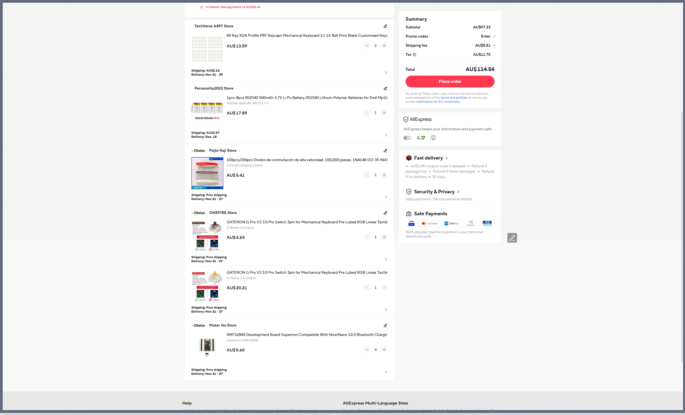

# keyboard
*my project for hack club blueprint*

My design for a lily58 inspired split wireless keyboard using ergogen and kicad. It uses the NRF52840 chipset, and 3d printed parts mostly

One of my friends has significant wrist pain because his laptop keyboard is terrible. A few months ago we were planning to make a keyboard together and made things in Ergogen but never got that much further than that. Now, I have put things into kicad and done a bit more work in preparing things to be actually manufactured.
This is designed to be pretty much as cheap a keyboard as it is possible to manufacture, aiming for about AU$50 per keyboard (I am making two of these, so more like $100 total). This comes out to about $30 USD per keyboard, $60 total.

## Design
### PCB
- Ergogen for PCB design and layout drafting. It is a very simple, user friendly and powerful program. You define layouts for rows and columns, and nets to connect them
  - Note: In my Ergogen file there is a single net that was not correct, and I had to route manually in KiCad. This is the upper thumb cluster key.
- KiCad for routing the pcb. Ergogen creates the nets, so I only have to route it -- as such, there is no kicad schematic file, just a pcb file that I edited to design
- PCB: AllPcb. They had a cheap offer which let me get everything for a $2, including delivery.

### Case Design:
I use Fusion 360 in school, and am quite used to the program, so that is what I will use. As of November 1 2025, I haven't fully decided on the design -- but what I am thinking is that i will use a clean looking white coloured case, with an oiled plywood or even Jarrah laser cut bottom plate that fits in. My school has a good 3d printer (bambu p1s) and a laser cutter, so I can get everything designed there.
Ergogen outputs a DXF file for the bottom shape of the case, which is defined through the ```outlines``` section of ergogen.yml. This is the shape that I use for the outline of my PCB, so I will need to make an offset line around and use that as the case outline.
Also, since I will be taking this keyboard to and from school, I will make a hinging case to place the two halves in with foam padding for safety.

### Software
I will probably just go with zmk for this. One thing that is important to me is for the keyboard to run both wired and wireless - eg I plug one half with a usb C to A port into a school computer, and then that half talks to the other half and I can use it on computers without Bluetooth support; but I believe that QMK has this function so I will just use that. Potentially, if I have extra time, then I could code something custom in C, but I am not sure whether this is feasible at this point and with exams coming up.

Note: this software is in a seperate repo because of the way that ZMK works. The repo is [louis-bourgault/zmk-config](https://github.com/louis-bourgault/zmk-config)

# Images


# Bill of Materials

|Component Type       |Item Link                                                 |Quantity needed|Relevant Specifications       |Tax % (if not included)|Price each (AUD)|Total Cost (AUD)|Total Cost (USD) (using 1 AUD = 0.65 USD)|Running Cost (AUD|Running Cost (USD)|Note                                                                                                                                                       |
|---------------------|----------------------------------------------------------|---------------|------------------------------|-----------------------|----------------|----------------|-----------------------------------------|-----------------|------------------|-----------------------------------------------------------------------------------------------------------------------------------------------------------|
|Battery * 4          |https://www.aliexpress.com/item/1005006924508264.html?mp=1|1              |3.7v, 400mAh, 53x36x6mm, JSTPH|0.00%                  |$18.40          |$18.40          |$11.96                                   |$18.40           |$11.96            |                                                                                                                                                           |
|NRF52840             |https://www.aliexpress.com/item/1005006035267231.html?    |4              |                              |10.00%                 |$5.65           |$24.86          |$16.16                                   |$43.26           |$28.12            |                                                                                                                                                           |
|Keyboard Switch * 110|https://www.aliexpress.com/item/1005006376024657.html?mp=1|1              |Gateron Brown * 110           |10.00%                 |$18.33          |$20.16          |$13.11                                   |$63.42           |$41.22            |This is using my Welcome Deal on Aliexpress                                                                                                                |
|Keyboard Switch * 10 |https://www.aliexpress.com/item/1005006376024657.html?mp=1|1              |Gateron Yellow * 10           |10.00%                 |$4.70           |$5.17           |$3.36                                    |$68.59           |$44.59            |Supplemental Switches, not on welcome deal so substantially more expensive. Will use different type of switch (linear instead of tactile) for modifier keys|
|Diodes * 200         |https://www.aliexpress.com/item/1005009896621714.html     |1              |Basic 1n4148 diodes           |10.00%                 |$5.94           |$6.53           |$4.25                                    |$75.13           |$48.83            |                                                                                                                                                           |
|PCB * 5              |AllPCB                                                    |1              |                              |0.00%                  |$2.14           |$2.14           |$1.39                                    |$77.27           |$50.22            |already purchased                                                                                                                                          |
|Keycaps * 80         |https://www.aliexpress.com/item/1005007415198959.html?mp=1|2              |                              |10.00%                 |$13.58          |$29.88          |$19.42                                   |$107.14          |$69.64            |                                                                                                                                                           |


# Note on Pricing
Since a lot of these sites have little fees that are hard to deal with on a one by one basis (such as payment processing fees, et cetera). So, the final numbers as given at checkout are slightly different.
Additionally, there is a chance that these prices may fluctuate. If they go up at all, I am able to cover the cost (I am willing to spend a bit of my money on this, and don't need a grant for all of it).



Note: this order actually cost me $2.14, it's just not showing the right amount because that was a one time discount

Prices:
- Aliexpress: AU$114.54
- Allpcb: AU$2.14

Total: AU$116.68
In USD: US$76.20
Note: if I do not qualify for a full support, i can cover a portion of it.
